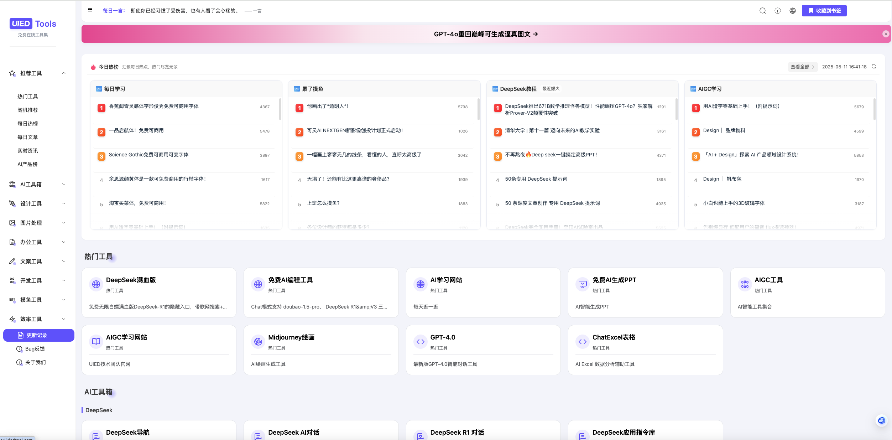

# UIED Tools - 免费在线工具集合与AI学习平台

> 最近更新：新增AI学习平台、资讯热榜及多个设计开发工具

这是一个功能丰富的免费在线工具集合网站，专注于为设计师、开发者和 AI 爱好者提供一站式解决方案。项目不仅集成了 AI 工具、设计工具、开发工具，还提供了丰富的 AI 学习资源和资讯。

**在线资源矩阵：**
- **在线工具站**：[UIED免费在线工具集](https://uiedtool.com/)
- **AI学习平台**：[UIED官网](https://www.uied.cn/)
- **AI资讯热榜**：[AI资讯热榜](https://hot.uied.cn)
- **AI工具导航**：[AI工具导航](https://hao.uied.cn/ai)
- **AI知识库**：[AIGC知识共享社区](https://ai.feishu.cn/wiki/ZjddwTFpWivK6ukwBoDc5DoHnVt?from=from_copylink)



## 更新日志
<a href="https://uiedtool.com/changelog" target="_blank">查看完整更新日志</a>

### 项目亮点

- **AI 赋能**：集成 AI 对话、AI 绘画、AI 资讯等前沿工具，助你拥抱 AIGC 时代。
- **设计师友好**：提供色彩提取、渐变生成、对比度检测、玻璃拟态等专属设计工具。
- **丰富多样**：提供超过 227+ 种常用工具，覆盖设计、开发、文本处理、图片处理等多个领域。
- **简洁易用**：采用直观的 UI 设计，让用户快速找到并使用所需工具。
- **完全免费**：所有工具完全免费使用，无需注册和付费。
- **持续更新**：定期添加新工具，不断优化已有功能。
- **开源共享**：项目代码完全开源，欢迎社区贡献和改进
- **中文优化**：专为中文用户设计，提供本地化的使用体验

UIED Tools 基于 Vue3、TypeScript 和 Element Plus 开发，支持响应式布局，能够在桌面端和移动端提供良好的使用体验。

## 快速开始

### 环境要求
- Node.js 版本: >= 16.0.0
- npm 版本: >= 8.0.0

### 安装步骤

#### 方法一：从源码安装（推荐开发者使用）

1. 克隆仓库到本地
```bash
# 从Gitee克隆
git clone https://gitee.com/tomdac/uied-tools.git

# 或从GitHub克隆
git clone https://github.com/Tomccc520/UIED-tools.git

# 进入项目目录
cd uied-tools
```

2. 安装依赖
```bash
# 使用npm安装（推荐）
npm install

# 或使用yarn
yarn install

# 或使用pnpm
pnpm install
```

3. 启动开发服务器
```bash
# 开发模式启动
npm run dev

# 指定端口启动
npm run dev -- --port 3000
```

4. 构建生产版本
```bash
# 标准构建
npm run build

# 包含SEO优化的构建（推荐生产环境使用）
npm run build:pro

# 预览构建结果
npm run preview
```

#### 方法二：使用Docker部署（推荐运维人员使用）

```bash
# 拉取镜像
docker pull docker0796/tools-web:latest

# 运行容器
docker run -d --name tools-web --restart unless-stopped -p 8080:80 docker0796/tools-web:latest

# 访问服务
# 浏览器打开 http://localhost:8080
```

## 项目结构说明

```
uied-tools/
├── src/                      # 源代码目录
│   ├── components/          # 组件目录
│   │   ├── Common/         # 公共组件
│   │   │   └── ToolsRecommend.vue  # 工具推荐组件
│   │   ├── Home/           # 首页相关组件
│   │   ├── Layout/         # 布局组件
│   │   │   ├── Left/      # 左侧菜单
│   │   │   └── Right/     # 右侧推荐栏
│   │   └── Tools/          # 工具组件目录
│   │       ├── AI/        # AI相关工具
│   │       ├── Avatar/    # 头像相关工具
│   │       ├── Copywriting/ # 文案相关工具
│   │       ├── Design/    # 设计相关工具
│   │       ├── Dev/       # 开发相关工具
│   │       ├── tools.ts   # 工具配置文件
│   │       └── ToolIcon.vue # 工具图标组件
│   ├── router/             # 路由配置
│   │   └── router.ts      # 主路由文件
│   ├── store/              # 状态管理
│   │   └── modules/       # 状态模块
│   ├── assets/             # 静态资源
│   │   ├── icons/         # SVG图标
│   │   └── styles/        # 全局样式
│   ├── utils/              # 工具函数
│   └── App.vue             # 根组件
├── public/                 # 公共资源目录
├── docs/                   # 文档目录
├── scripts/                # 脚本目录
├── dist/                   # 构建输出目录
├── .env.development        # 开发环境配置
├── .env.production         # 生产环境配置
├── vite.config.ts          # Vite配置
├── tailwind.config.js      # Tailwind CSS配置
├── tsconfig.json           # TypeScript配置
├── package.json            # 项目依赖配置
└── README.md               # 项目说明文档
```

## 开发指南

### 添加新工具

添加新工具需要完成以下四个步骤：

1. **创建工具组件**

在 `src/components/Tools` 对应分类目录下创建新的组件文件。例如要创建一个新的AI工具，可以在 `src/components/Tools/AI/` 目录下创建：

```vue
<!-- NewAITool.vue -->
<template>
  <div class="p-6 bg-white rounded-lg shadow-sm">
    <h2 class="text-xl font-bold mb-4">新AI工具</h2>

    <!-- 工具主体内容 -->
    <div class="mb-4">
      <el-input v-model="inputText" placeholder="请输入内容" />
    </div>

    <!-- 操作按钮 -->
    <div class="flex justify-between">
      <el-button type="primary" @click="processData">处理</el-button>
      <el-button @click="resetForm">重置</el-button>
    </div>

    <!-- 结果展示区域 -->
    <div v-if="result" class="mt-4 p-4 bg-gray-50 rounded">
      <p>{{ result }}</p>
    </div>

    <!-- 底部推荐工具 -->
    <ToolsRecommend :currentPath="route.path" />
  </div>
</template>

<script setup lang="ts">
import { ref } from 'vue'
import { useRoute } from 'vue-router'
import ToolsRecommend from '@/components/Common/ToolsRecommend.vue'

const route = useRoute()
const inputText = ref('')
const result = ref('')

// 处理数据函数
const processData = () => {
  // 实现工具核心逻辑
  result.value = `处理结果: ${inputText.value}`
}

// 重置表单函数
const resetForm = () => {
  inputText.value = ''
  result.value = ''
}
</script>
```

2. **添加路由配置**

在 `src/router/router.ts` 文件中添加新工具的路由配置：

```typescript
// router.ts
{
  path: '/tools/ai/new-tool',
  component: () => import('@/components/Tools/AI/NewAITool.vue'),
  name: 'newAITool',
  meta: {
    title: "新AI工具",
    keywords: 'AI工具,人工智能,新工具',
    description: '这是一个强大的AI新工具，可以帮助用户快速处理数据',
  }
}
```

3. **注册工具信息**

在 `src/components/Tools/tools.ts` 中的合适位置添加工具信息：

```typescript
// tools.ts
// 在AI工具分类中添加
{
  id: 123,
  title: "新AI工具",
  logo: { type: 'svg', name: 'newAITool' }, // 使用SVG图标
  desc: "强大的AI工具，可快速处理数据",
  url: "/tools/ai/new-tool",
  cateId: 1,
  cate: 'AI工具',
  tags: ['新品']  // 可选：添加标签
}
```

4. **添加SVG图标**（可选）

如果使用SVG图标，将图标文件放入 `src/assets/icons/` 目录下，命名为 `newAITool.svg`。

完成以上步骤后，刷新页面即可看到新添加的工具。

## 注意事项

### 1. 环境配置
- **开发环境**：使用 `.env.development` 配置文件
  ```
  NODE_ENV=development
  VITE_API_BASE_URL=http://localhost:8080/api
  ```
- **生产环境**：使用 `.env.production` 配置文件
  ```
  NODE_ENV=production
  VITE_API_BASE_URL=https://api.example.com
  ```
- **本地配置**：可创建 `.env.local` 进行本地覆盖（不会提交到代码库）

### 2. 代码规范
- **TypeScript**：所有新代码必须使用TypeScript编写
  - 开启严格模式：`"strict": true`
  - 使用类型标注：`const name: string = 'value'`
- **Vue 规范**：
  - 使用 Vue 3 Composition API
  - 使用 `<script setup>` 语法糖
  - 保持组件单一职责
- **样式规范**：
  - 使用 Tailwind CSS 实用类优先
  - 自定义样式使用 scoped CSS
  - 遵循 Element Plus 的设计规范

### 3. 性能优化准则
- **路由懒加载**：所有页面组件使用动态导入
  ```typescript
  {
    path: '/tools/example',
    component: () => import('@/components/Tools/Example.vue') // 懒加载
  }
  ```
- **组件按需导入**：使用 Element Plus 的按需导入
  ```typescript
  import { ElButton, ElInput } from 'element-plus'
  ```
- **资源优化**：
  - 图片使用WebP格式
  - SVG图标使用单色线性风格
  - 大型资源使用CDN加载

### 4. Git提交规范
- **提交信息格式**：`<类型>: <描述>`
- **常用类型**：
  - `feat`：新功能
  - `fix`：bug修复
  - `docs`：文档更新
  - `style`：代码格式调整
  - `refactor`：代码重构
  - `perf`：性能优化
  - `test`：测试相关
  - `chore`：构建过程或辅助工具变动

## 常见问题与解决方案

### 1. 依赖相关问题

#### 安装依赖失败
```bash
# 方法1：清除npm缓存后重试
npm cache clean --force
npm install

# 方法2：使用镜像源
npm config set registry https://registry.npmmirror.com
npm install

# 方法3：尝试使用其他包管理器
yarn install
# 或
pnpm install
```

#### 依赖版本冲突
```bash
# 更新依赖到兼容版本
npm update

# 检查有问题的依赖
npm ls <package-name>

# 强制解决冲突
npm install --force
```

### 2. 开发环境问题

#### 开发服务器启动失败
- **端口占用**：修改 `vite.config.ts` 中的端口
  ```typescript
  export default defineConfig({
    server: {
      port: 3000  // 修改为其他端口
    }
  })
  ```
- **模块解析错误**：
  ```bash
  # 删除node_modules和lock文件后重新安装
  rm -rf node_modules package-lock.json
  npm install
  ```
- **Node.js版本问题**：使用 nvm 安装正确版本
  ```bash
  nvm install 16
  nvm use 16
  ```

#### 热更新不工作
- 检查 `vite.config.ts` 中的 `server.hmr` 配置
- 确认系统文件监听限制（Linux系统）
- 重启开发服务器

### 3. 构建与部署问题

#### 构建失败
- **语法错误**：检查控制台错误信息，修复对应代码
- **内存不足**：增加Node内存限制
  ```bash
  # 增加内存限制
  export NODE_OPTIONS=--max-old-space-size=4096
  npm run build
  ```
- **依赖缺失**：确认所有依赖正确安装
  ```bash
  npm install --legacy-peer-deps
  ```

#### 部署问题
- **静态资源路径错误**：检查 `vite.config.ts` 中的 `base` 配置
  ```typescript
  export default defineConfig({
    base: '/'  // 根据实际部署路径调整
  })
  ```
- **Docker部署问题**：参考前面的Docker部署指南
- **SSR渲染问题**：查看SSR构建日志，修复服务端渲染错误

## 技术栈详解

### 核心技术

| 技术 | 版本 | 用途 | 文档链接 |
|------|------|------|----------|
| Vue | 3.3.10 | 前端框架 | [Vue文档](https://cn.vuejs.org/) |
| TypeScript | 5.3.3 | 类型检查 | [TS文档](https://www.typescriptlang.org/zh/) |
| Vite | 5.0.10 | 构建工具 | [Vite文档](https://cn.vitejs.dev/) |
| Pinia | 2.1.7 | 状态管理 | [Pinia文档](https://pinia.vuejs.org/zh/) |
| Vue Router | 4.2.5 | 路由管理 | [Router文档](https://router.vuejs.org/zh/) |

### UI框架与样式

| 技术 | 版本 | 用途 | 文档链接 |
|------|------|------|----------|
| Element Plus | 2.7.0 | UI组件库 | [Element Plus文档](https://element-plus.org/zh-CN/) |
| Tailwind CSS | 3.3.5 | 原子CSS框架 | [Tailwind文档](https://tailwindcss.com/) |
| PostCSS | 8.4.32 | CSS处理器 | [PostCSS文档](https://postcss.org/) |

### 工具库

| 技术 | 用途 | 文档链接 |
|------|------|----------|
| Axios | HTTP请求 | [Axios文档](https://axios-http.com/zh/) |
| VueUse | 实用工具集 | [VueUse文档](https://vueuse.org/) |
| Day.js | 日期处理 | [Day.js文档](https://day.js.org/) |
| ECharts | 数据可视化 | [ECharts文档](https://echarts.apache.org/zh/index.html) |

### 开发工具

| 技术 | 用途 | 推荐配置 |
|------|------|----------|
| VS Code | 代码编辑器 | 推荐插件：Volar, ESLint, Prettier |
| ESLint | 代码检查 | 配置文件：`.eslintrc.js` |
| Prettier | 代码格式化 | 配置文件：`.prettierrc` |
| Git | 版本控制 | 配合Husky进行提交校验 |

## 贡献指南

欢迎为 UIED Tools 项目做出贡献！请遵循以下步骤：

### 贡献流程

1. **Fork 仓库**
   - 访问 [GitHub仓库](https://github.com/Tomccc520/UIED-tools) 或 [Gitee仓库](https://gitee.com/tomdac/uied-tools)
   - 点击右上角"Fork"按钮创建个人分支

2. **克隆到本地**
   ```bash
   git clone https://github.com/你的用户名/UIED-tools.git
   cd UIED-tools
   ```

3. **创建功能分支**
   ```bash
   # 以功能命名分支
   git checkout -b feature/新功能名称
   # 或以修复命名分支
   git checkout -b fix/问题名称
   ```

4. **开发与测试**
   - 进行代码修改和开发
   - 运行测试确保功能正常
   - 遵循代码规范和样式指南

5. **提交更改**
   ```bash
   git add .
   git commit -m "feat: 添加了xxx功能"
   ```

6. **推送到GitHub**
   ```bash
   git push origin feature/新功能名称
   ```

7. **创建 Pull Request**
   - 访问你Fork的仓库
   - 点击"New Pull Request"按钮
   - 选择你的功能分支和原仓库的主分支
   - 填写PR描述，说明更改内容和目的

### 贡献类型

我们欢迎多种形式的贡献：

- **代码贡献**：修复bug或添加新功能
- **文档完善**：改进文档说明或添加示例
- **问题反馈**：提交BUG报告或功能建议
- **UI改进**：优化界面设计和用户体验
- **测试用例**：增加测试覆盖率

### 代码审查

所有PR会经过核心团队成员的审查，可能需要进行以下修改：

- 遵循项目代码规范
- 确保没有引入新的Bug
- 提供适当的文档和注释
- 添加必要的测试用例

### 开发者社区

- **交流渠道**：加入我们的[讨论区](https://github.com/Tomccc520/UIED-tools/discussions)
- **问题跟踪**：使用[Issues](https://github.com/Tomccc520/UIED-tools/issues)报告问题
- **路线图**：查看[Projects](https://github.com/Tomccc520/UIED-tools/projects)了解开发计划

### 行为准则

请所有贡献者遵守我们的行为准则：

- 尊重每一位社区成员
- 使用友好和包容的语言
- 接受建设性的批评和反馈
- 专注于什么对社区最有利
- 对其他社区成员表示同理心

## 许可证

MIT License

Copyright (c) 2025 UIED Team

Permission is hereby granted, free of charge, to any person obtaining a copy
of this software and associated documentation files (the "Software"), to deal
in the Software without restriction, including without limitation the rights
to use, copy, modify, merge, publish, distribute, sublicense, and/or sell
copies of the Software, and to permit persons to whom the Software is
furnished to do so, subject to the following conditions:

The above copyright notice and this permission notice shall be included in all
copies or substantial portions of the Software.

THE SOFTWARE IS PROVIDED "AS IS", WITHOUT WARRANTY OF ANY KIND, EXPRESS OR
IMPLIED, INCLUDING BUT NOT LIMITED TO THE WARRANTIES OF MERCHANTABILITY,
FITNESS FOR A PARTICULAR PURPOSE AND NONINFRINGEMENT. IN NO EVENT SHALL THE
AUTHORS OR COPYRIGHT HOLDERS BE LIABLE FOR ANY CLAIM, DAMAGES OR OTHER
LIABILITY, WHETHER IN AN ACTION OF CONTRACT, TORT OR OTHERWISE, ARISING FROM,
OUT OF OR IN CONNECTION WITH THE SOFTWARE OR THE USE OR OTHER DEALINGS IN THE
SOFTWARE.
