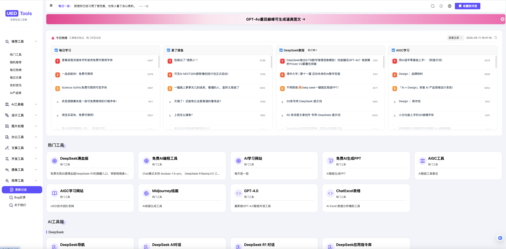

# UIED Tools 3.0.1 - 全栈开源在线工具平台

> Vue 3 主站 + Go API + Arco Pro 管理后台，面向免费工具、内容运营、SEO 和社区共建。

UIED Tools 是面向设计师、开发者和 AI 使用者的免费在线工具平台。3.0.1 起，主站、Go API、管理后台、数据库脚本和部署工具统一开放源码，不再区分“纯前端开源版”和“后台商业版”。

项目当前以工具流量和内容增长为优先：核心工具免费使用，会员、订单和支付模块作为可选能力保留，默认不展示非必要商业化入口。

**源码仓库：** [https://github.com/Tomccc520/UIED-tools](https://github.com/Tomccc520/UIED-tools)

**Gitee 镜像：** [https://gitee.com/tomdac/uied-tools](https://gitee.com/tomdac/uied-tools)

**在线资源矩阵：**
- **在线工具站**：[UIED免费在线工具集](https://uiedtool.com/)
- **AI学习平台**：[UIED官网](https://www.uied.cn/)
- **AI资讯热榜**：[AI资讯热榜](https://hot.uied.cn)
- **AI工具导航**：[AI工具导航](https://hao.uied.cn/ai)
- **AI知识库**：[AIGC知识共享社区](https://ai.feishu.cn/wiki/ZjddwTFpWivK6ukwBoDc5DoHnVt?from=from_copylink)



## 更新日志
<a href="https://uiedtool.com/changelog" target="_blank">查看完整更新日志</a>

### 3.0.1 新增后台

- **Go API**：基于 Gin 与 likeadmin-go，提供站点配置、菜单权限、工具策略、用户、日志和系统能力。
- **Arco Pro 管理端**：管理头部、侧栏、页脚、SEO、更新记录、工具主数据、AI Provider 等运营配置。
- **同域部署**：主站 `/`、管理端 `/admin/`、接口 `/api/`，支持 Nginx 与宝塔部署。
- **配置闭环**：关键保存操作包含服务端校验、保存回读和明确的成功/失败提示。
- **自用模式**：默认隐藏非必要商业化入口，保留后续扩展空间。

### 项目亮点

- **AI 赋能**：集成 AI 对话、AI 绘画、AI 资讯等前沿工具，助你拥抱 AIGC 时代。
- **设计师友好**：提供色彩提取、渐变生成、对比度检测、玻璃拟态等专属设计工具。
- **丰富多样**：提供 334 个常用工具，覆盖设计、开发、文本处理、图片处理等多个领域。
- **简洁易用**：采用直观的 UI 设计，让用户快速找到并使用所需工具。
- **免费优先**：登录可由后台关闭，关闭后现有工具可免登录使用。
- **持续更新**：优先打磨高价值工具、结果质量、移动端和失败兜底。
- **全栈开源**：主站、API、管理端、SQL 与部署脚本均在同一仓库，欢迎提交 Issue 和 PR。
- **中文优化**：专为中文用户设计，提供本地化的使用体验

UIED Tools 主站基于 Vue 3、TypeScript 和 Element Plus，管理端基于 Vue 3 与 Arco Design，服务端使用 Go、Gin、MySQL 和 Redis。

## 快速开始

### 环境要求
- Node.js 版本：推荐 20 LTS
- npm 版本：推荐 10+
- Go 版本：推荐 1.20+
- MySQL 5.7+/8.0 与 Redis 6+
- Docker（可选，本地基础依赖与生产容器部署使用）

### 安装步骤

#### 方法一：启动完整开发环境（推荐）

1. 克隆仓库到本地
```bash
git clone https://github.com/Tomccc520/UIED-tools.git

# 进入项目目录
cd uied-tools
```

2. 安装主站依赖
```bash
# 使用npm安装（推荐）
npm install

# 或使用yarn
yarn install

# 或使用pnpm
pnpm install
```

3. 一键启动主站、Go API、管理端、MySQL 与 Redis
```bash
npm run dev:fullstack:start

# 查看服务地址与健康状态
npm run dev:fullstack:status

# 停止应用；加 stop:all 可同时停止基础依赖
npm run dev:fullstack:stop
```

4. 仅开发主站时
```bash
npm run dev
```

5. 构建与检查
```bash
npm run build:check

# 管理端
cd backend/likeadmin-go/admin
npm install
npm run build

# Go API
cd ../server
go test ./...
go build .
```

#### 方法二：生产部署

完整生产部署包含主站静态资源、管理端静态资源、Go API、MySQL 与 Redis。宝塔环境请参考：

- [`docs/uiedtool-3.0.1-baota-deploy.md`](docs/uiedtool-3.0.1-baota-deploy.md)
- [`scripts/release/package-fullstack.sh`](scripts/release/package-fullstack.sh)

```bash
npm run build:check
npm run release:fullstack
```

正式发布文件会统一生成到 `output/production/uiedtool-3.0.1/`。不要把示例数据库密码或第三方 API 密钥直接用于生产环境。

## 项目结构说明

```
uied-tools/
├── src/                      # 源代码目录
│   ├── components/          # 组件目录
│   │   ├── Common/         # 公共组件
│   │   │   └── ToolsRecommend.vue  # 工具推荐组件
│   │   ├── Home/           # 首页相关组件
│   │   ├── Layout/         # 布局组件
│   │   │   ├── Left/      # 左侧菜单
│   │   │   └── Right/     # 右侧推荐栏
│   │   └── Tools/          # 工具组件目录
│   │       ├── AI/        # AI相关工具
│   │       ├── Avatar/    # 头像相关工具
│   │       ├── Copywriting/ # 文案相关工具
│   │       ├── Design/    # 设计相关工具
│   │       ├── Dev/       # 开发相关工具
│   │       ├── tools.ts   # 工具配置文件
│   │       └── ToolIcon.vue # 工具图标组件
│   ├── router/             # 路由配置
│   │   └── router.ts      # 主路由文件
│   ├── store/              # 状态管理
│   │   └── modules/       # 状态模块
│   ├── assets/             # 静态资源
│   │   ├── icons/         # SVG图标
│   │   └── styles/        # 全局样式
│   ├── utils/              # 工具函数
│   └── App.vue             # 根组件
├── public/                 # 公共资源目录
├── backend/
│   └── likeadmin-go/
│       ├── admin/          # Arco Pro 管理端
│       ├── server/         # Go API
│       └── sql/            # 安装 SQL 与增量补丁
├── docs/                   # 文档目录
├── scripts/                # 脚本目录
├── deploy/                 # Nginx、systemd 与生产环境示例
├── output/                 # 本地发布输出（不提交）
├── vite.config.ts          # Vite配置
├── tailwind.config.js      # Tailwind CSS配置
├── tsconfig.json           # TypeScript配置
├── package.json            # 项目依赖配置
└── README.md               # 项目说明文档
```

## 开发指南

### 添加新工具

添加新工具需要完成以下四个步骤：

1. **创建工具组件**

在 `src/components/Tools` 对应分类目录下创建新的组件文件。例如要创建一个新的AI工具，可以在 `src/components/Tools/AI/` 目录下创建：

```vue
<!-- NewAITool.vue -->
<template>
  <div class="p-6 bg-white rounded-lg shadow-sm">
    <h2 class="text-xl font-bold mb-4">新AI工具</h2>

    <!-- 工具主体内容 -->
    <div class="mb-4">
      <el-input v-model="inputText" placeholder="请输入内容" />
    </div>

    <!-- 操作按钮 -->
    <div class="flex justify-between">
      <el-button type="primary" @click="processData">处理</el-button>
      <el-button @click="resetForm">重置</el-button>
    </div>

    <!-- 结果展示区域 -->
    <div v-if="result" class="mt-4 p-4 bg-gray-50 rounded">
      <p>{{ result }}</p>
    </div>

    <!-- 底部推荐工具 -->
    <ToolsRecommend :currentPath="route.path" />
  </div>
</template>

<script setup lang="ts">
import { ref } from 'vue'
import { useRoute } from 'vue-router'
import ToolsRecommend from '@/components/Common/ToolsRecommend.vue'

const route = useRoute()
const inputText = ref('')
const result = ref('')

// 处理数据函数
const processData = () => {
  // 实现工具核心逻辑
  result.value = `处理结果: ${inputText.value}`
}

// 重置表单函数
const resetForm = () => {
  inputText.value = ''
  result.value = ''
}
</script>
```

2. **添加路由配置**

在 `src/router/router.ts` 文件中添加新工具的路由配置：

```typescript
// router.ts
{
  path: '/tools/ai/new-tool',
  component: () => import('@/components/Tools/AI/NewAITool.vue'),
  name: 'newAITool',
  meta: {
    title: "新AI工具",
    keywords: 'AI工具,人工智能,新工具',
    description: '这是一个强大的AI新工具，可以帮助用户快速处理数据',
  }
}
```

3. **注册工具信息**

在 `src/components/Tools/tools.ts` 中的合适位置添加工具信息：

```typescript
// tools.ts
// 在AI工具分类中添加
{
  id: 123,
  title: "新AI工具",
  logo: { type: 'svg', name: 'newAITool' }, // 使用SVG图标
  desc: "强大的AI工具，可快速处理数据",
  url: "/tools/ai/new-tool",
  cateId: 1,
  cate: 'AI工具',
  tags: ['新品']  // 可选：添加标签
}
```

4. **添加SVG图标**（可选）

如果使用SVG图标，将图标文件放入 `src/assets/icons/` 目录下，命名为 `newAITool.svg`。

完成以上步骤后，刷新页面即可看到新添加的工具。

## 注意事项

### 1. 环境配置
- **开发环境**：使用 `.env.development` 配置文件
  ```
  NODE_ENV=development
  VITE_API_BASE_URL=http://localhost:8080/api
  ```
- **生产环境**：使用 `.env.production` 配置文件
  ```
  NODE_ENV=production
  VITE_API_BASE_URL=https://api.example.com
  ```
- **本地配置**：可创建 `.env.local` 进行本地覆盖（不会提交到代码库）

### 2. 代码规范
- **TypeScript**：所有新代码必须使用TypeScript编写
  - 开启严格模式：`"strict": true`
  - 使用类型标注：`const name: string = 'value'`
- **Vue 规范**：
  - 使用 Vue 3 Composition API
  - 使用 `<script setup>` 语法糖
  - 保持组件单一职责
- **样式规范**：
  - 使用 Tailwind CSS 实用类优先
  - 自定义样式使用 scoped CSS
  - 遵循 Element Plus 的设计规范

### 3. 性能优化准则
- **路由懒加载**：所有页面组件使用动态导入
  ```typescript
  {
    path: '/tools/example',
    component: () => import('@/components/Tools/Example.vue') // 懒加载
  }
  ```
- **组件按需导入**：使用 Element Plus 的按需导入
  ```typescript
  import { ElButton, ElInput } from 'element-plus'
  ```
- **资源优化**：
  - 图片使用WebP格式
  - SVG图标使用单色线性风格
  - 大型资源使用CDN加载

### 4. Git提交规范
- **提交信息格式**：`<类型>: <描述>`
- **常用类型**：
  - `feat`：新功能
  - `fix`：bug修复
  - `docs`：文档更新
  - `style`：代码格式调整
  - `refactor`：代码重构
  - `perf`：性能优化
  - `test`：测试相关
  - `chore`：构建过程或辅助工具变动

## 常见问题与解决方案

### 1. 依赖相关问题

#### 安装依赖失败
```bash
# 方法1：清除npm缓存后重试
npm cache clean --force
npm install

# 方法2：使用镜像源
npm config set registry https://registry.npmmirror.com
npm install

# 方法3：尝试使用其他包管理器
yarn install
# 或
pnpm install
```

#### 依赖版本冲突
```bash
# 更新依赖到兼容版本
npm update

# 检查有问题的依赖
npm ls <package-name>

# 强制解决冲突
npm install --force
```

### 2. 开发环境问题

#### 开发服务器启动失败
- **端口占用**：修改 `vite.config.ts` 中的端口
  ```typescript
  export default defineConfig({
    server: {
      port: 3000  // 修改为其他端口
    }
  })
  ```
- **模块解析错误**：
  ```bash
  # 删除node_modules和lock文件后重新安装
  rm -rf node_modules package-lock.json
  npm install
  ```
- **Node.js版本问题**：使用 nvm 安装正确版本
  ```bash
  nvm install 16
  nvm use 16
  ```

#### 热更新不工作
- 检查 `vite.config.ts` 中的 `server.hmr` 配置
- 确认系统文件监听限制（Linux系统）
- 重启开发服务器

### 3. 构建与部署问题

#### 构建失败
- **语法错误**：检查控制台错误信息，修复对应代码
- **内存不足**：增加Node内存限制
  ```bash
  # 增加内存限制
  export NODE_OPTIONS=--max-old-space-size=4096
  npm run build
  ```
- **依赖缺失**：确认所有依赖正确安装
  ```bash
  npm install --legacy-peer-deps
  ```

#### 部署问题
- **静态资源路径错误**：检查 `vite.config.ts` 中的 `base` 配置
  ```typescript
  export default defineConfig({
    base: '/'  // 根据实际部署路径调整
  })
  ```
- **Docker部署问题**：参考前面的Docker部署指南
- **SSR渲染问题**：查看SSR构建日志，修复服务端渲染错误

## 技术栈详解

### 核心技术

| 技术 | 版本 | 用途 | 文档链接 |
|------|------|------|----------|
| Vue | 3.3.10 | 前端框架 | [Vue文档](https://cn.vuejs.org/) |
| TypeScript | 5.3.3 | 类型检查 | [TS文档](https://www.typescriptlang.org/zh/) |
| Vite | 5.0.10 | 构建工具 | [Vite文档](https://cn.vitejs.dev/) |
| Pinia | 2.1.7 | 状态管理 | [Pinia文档](https://pinia.vuejs.org/zh/) |
| Vue Router | 4.2.5 | 路由管理 | [Router文档](https://router.vuejs.org/zh/) |

### UI框架与样式

| 技术 | 版本 | 用途 | 文档链接 |
|------|------|------|----------|
| Element Plus | 2.7.0 | UI组件库 | [Element Plus文档](https://element-plus.org/zh-CN/) |
| Tailwind CSS | 3.3.5 | 原子CSS框架 | [Tailwind文档](https://tailwindcss.com/) |
| PostCSS | 8.4.32 | CSS处理器 | [PostCSS文档](https://postcss.org/) |

### 工具库

| 技术 | 用途 | 文档链接 |
|------|------|----------|
| Axios | HTTP请求 | [Axios文档](https://axios-http.com/zh/) |
| VueUse | 实用工具集 | [VueUse文档](https://vueuse.org/) |
| Day.js | 日期处理 | [Day.js文档](https://day.js.org/) |
| ECharts | 数据可视化 | [ECharts文档](https://echarts.apache.org/zh/index.html) |

### 开发工具

| 技术 | 用途 | 推荐配置 |
|------|------|----------|
| VS Code | 代码编辑器 | 推荐插件：Volar, ESLint, Prettier |
| ESLint | 代码检查 | 配置文件：`.eslintrc.js` |
| Prettier | 代码格式化 | 配置文件：`.prettierrc` |
| Git | 版本控制 | 配合Husky进行提交校验 |

## 贡献指南

欢迎为 UIED Tools 项目做出贡献！请遵循以下步骤：

### 贡献流程

1. **Fork 仓库**
   - 访问 [GitHub 仓库](https://github.com/Tomccc520/UIED-tools)
   - 点击右上角"Fork"按钮创建个人分支

2. **克隆到本地**
   ```bash
   git clone https://github.com/你的用户名/UIED-tools.git
   cd UIED-tools
   ```

3. **创建功能分支**
   ```bash
   # 以功能命名分支
   git checkout -b feature/新功能名称
   # 或以修复命名分支
   git checkout -b fix/问题名称
   ```

4. **开发与测试**
   - 进行代码修改和开发
   - 运行测试确保功能正常
   - 遵循代码规范和样式指南

5. **提交更改**
   ```bash
   git add .
   git commit -m "feat: 添加了xxx功能"
   ```

6. **推送到GitHub**
   ```bash
   git push origin feature/新功能名称
   ```

7. **创建 Pull Request**
   - 访问你Fork的仓库
   - 点击"New Pull Request"按钮
   - 选择你的功能分支和原仓库的主分支
   - 填写PR描述，说明更改内容和目的

### 贡献类型

我们欢迎多种形式的贡献：

- **代码贡献**：修复bug或添加新功能
- **文档完善**：改进文档说明或添加示例
- **问题反馈**：提交BUG报告或功能建议
- **UI改进**：优化界面设计和用户体验
- **测试用例**：增加测试覆盖率

### 代码审查

所有PR会经过核心团队成员的审查，可能需要进行以下修改：

- 遵循项目代码规范
- 确保没有引入新的Bug
- 提供适当的文档和注释
- 添加必要的测试用例

### 开发者社区

- **问题跟踪**：使用 [Issues](https://github.com/Tomccc520/UIED-tools/issues) 报告问题
- **功能贡献**：通过 [Pull Requests](https://github.com/Tomccc520/UIED-tools/pulls) 提交改进
- **在线体验**：访问 [uiedtool.com](https://uiedtool.com/) 验证当前正式版本

### 行为准则

请所有贡献者遵守我们的行为准则：

- 尊重每一位社区成员
- 使用友好和包容的语言
- 接受建设性的批评和反馈
- 专注于什么对社区最有利
- 对其他社区成员表示同理心

## 许可证

UIED Tools 主体代码采用 [MIT License](LICENSE)。

- Go 管理后台基于 likeadmin-go 二次开发，并保留其 MIT 许可文件。
- 拼豆工具基于 Apache-2.0 项目二次开发，并在对应源码目录保留原始许可文件。
- 其他第三方依赖继续遵循各自许可证；商标、站点内容和第三方 API 不因代码开源自动获得授权。
